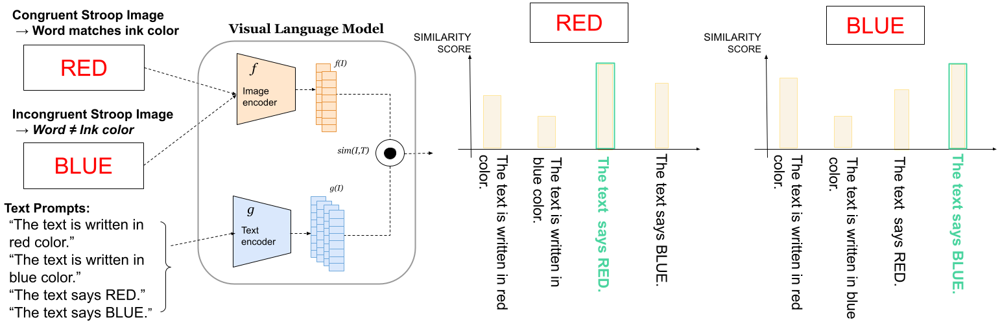
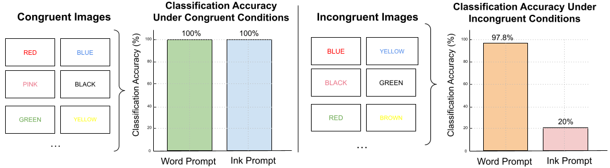

#  VLMRepo — Stroop-Style Multimodal Conflict in Vision–Language Models

### Repository Overview

This repository reproduces the experiments and analyses presented in:

> **"What is the Color of RED? Vision–Language Models Prefer to Read Rather Than See"**  
> _Under review at ICLR 2026_  
> **Nurbüke Teker**, Technical University of Munich (M.Sc. Informatics Thesis, 2025)

The project investigates how **Vision–Language Models (VLMs)** resolve conflicting cues between written words and their ink colors — adapting the **classical Stroop paradigm** from psychology.  
Our findings reveal a striking **textual dominance**: when the word and its ink color conflict, VLMs “read” the image rather than “see” it.

---

##  Research Goals

- Adapt the **Stroop test** to multimodal models (CLIP, SigLIP-2, LLaVA, BLIP-2, Kosmos-2, Qwen-VL, etc.)
- Quantify **word vs. color bias** behaviorally and representationally
- Analyze **embedding-space geometry** via RDMs and UMAP
- Apply **subpopulation-based latent interventions** (word vs. color chunks)
- Demonstrate how **representation saliency ⇒ steerability**

---

##  Repository Structure

```bash
VLMRepo/
│
├── datasets/
│   └── stroop_images/           # 100 balanced Stroop stimuli (10 colors × 10 words)
│
├── behavioural_analysis/
│   ├── clip_stroop_test.py      # CLIP & SigLIP-2 behavioural evaluation
│   ├── generative_vlm_eval.py   # LLaVA, BLIP-2, Kosmos-2, etc.
│   └── results/                 # Aggregated CSVs and plots
│
├── embedding_analysis/
│   ├── rdm_analysis.py          # Representational Dissimilarity Matrices
│   ├── umap_projection.py       # Low-dimensional visualization
│   └── plots/                   # Saved RDM & UMAP figures
│
├── interventions/
│   ├── utils_intervention.py    # Model loading & embedding utilities
│   ├── llava_color_intervention.py  # Latent steering experiments
│   └── results/                 # Intervention success heatmaps
│
├── notebooks/
│   └── vlm_stroop_summary.ipynb # End-to-end demonstration notebook
│
├── figures/
│   ├── fig1_stroop_scheme.png
│   ├── fig2_behavioral_results.png
│   ├── fig4_rdm_umap.png
│   ├── fig5_intervention_pipeline.png
│   └── fig6_intervention_heatmaps.png
│
└── README.md                    # (this file)

```
## 📊 Methodology

### 1️⃣ Stroop Dataset

100 synthetic images combining 10 color words and 10 ink colors:  
`red, blue, green, yellow, orange, purple, pink, brown, gray, black`.  
Each image is either **congruent** (word = ink) or **incongruent** (word ≠ ink).

Each file follows the format:

<WORD>_<INK>.png


e.g., BLUE_RED.png


<p align="center">
  
</p>

---

### 2️⃣ Behavioural Analysis

#### Contrastive Models (CLIP, SigLIP-2)

We compute the cosine similarity between image and text embeddings:

$$
s(I, T) = \frac{f(I) \cdot g(T)}{\|f(I)\| \|g(T)\|}
$$

| Model    | Word = Ink (%) | Word Acc. (%) | Ink Acc. (%) |
|:----------|:---------------:|:---------------:|:---------------:|
| **CLIP**     | 100.0 | 97.8 | 20.0 |
| **SigLIP-2** | 100.0 | 100.0 | 5.6 |

<p align="center">
  
</p>

#### Generative Models (LLaVA, BLIP-2, Kosmos-2, GIT, Qwen-VL)

When asked *“What color is the word in this image?”*,  
models overwhelmingly return the **word** instead of the ink color.

**LLaVA** shows partial correction (≈ 54 % Ink Match),  
while **Kosmos-2** and **BLIP-2** are strongly word-biased.

---

### 3️⃣ Representation Analysis

We compute **Representational Dissimilarity Matrices (RDMs)**  
to isolate modality-specific contributions:

$$
\Delta_{\text{Word}} = \text{RDM(Word + Ink)} - \text{RDM(Ink-only)}
$$

$$
\Delta_{\text{Ink}} = \text{RDM(Word + Ink)} - \text{RDM(Word-only)}
$$

Adding the **word** reshapes the embedding space more sharply than adding the **color**.

<p align="center">
  
</p>

---

### 4️⃣ Latent Interventions

Subpopulation-based steering modifies embeddings as:

$$
E' = E - \mu_{\text{src}} + \mu_{\text{tgt}}
$$

| Intervention Type | Success (%) | Mean Δ (sim shift) |
|:------------------|:------------:|:------------------:|
| **Ink Color** | 36.7 | −0.0017 |
| **Word** | 100.0 | +0.0934 |
| **Combined** | 100.0 | +0.1172 |

<p align="center">
  
</p>

---

##  Key Findings

| Aspect | Observation |
|:-------|:-------------|
| **Behavioral** | VLMs “read” rather than “see” under conflict. |
| **Representation** | Word cues form stronger, separable clusters. |
| **Intervention** | Word chunks steer embeddings reliably; color chunks fail. |
| **Generalization** | Text bias persists across fonts, contrasts, and pseudowords. |

---

##  Usage

```bash
git clone https://github.com/<yourname>/VLMRepo.git
cd VLMRepo
pip install -r requirements.txt

```

### Run the main evaluations:

```bash
python behavioural_analysis/clip_stroop_test.py
python interventions/llava_color_intervention.py

```


## Citation

@article{teker2026vlmstrop,
  title   = {What is the Color of RED? Vision--Language Models Prefer to Read Rather Than See},
  author  = {Nurbüke Teker},
  journal = {Under review at ICLR},
  year    = {2026}
}


## Acknowledgments

Developed as part of the M.Sc. Informatics Thesis
at Technical University of Munich (TUM) under the supervision of Dr. Shuchen Wu.
Based on open-source implementations of CLIP, SigLIP-2, LLaVA, and BLIP-2.


