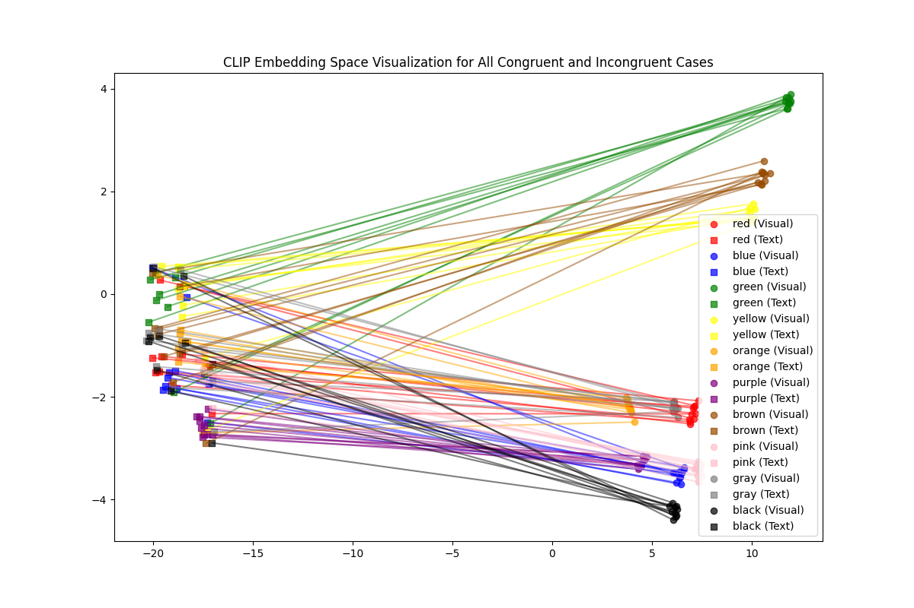

# 🧠 CLIP Embedding-Level Stroop Analysis

This repository evaluates how **CLIP** represents conflicting visual cues between **word meaning** and **ink color** in a Stroop-style task — both *numerically* (cosine similarity) and *geometrically* (UMAP visualization).

---

## 🎯 Objective

When a word like **RED** is written in **blue ink**, does CLIP’s embedding represent the **word** or the **color**?

We test this by comparing:
- The **image embedding** (from each Stroop image)  
- To the **text embeddings** of 10 color words  
  (`red, blue, green, yellow, orange, purple, brown, pink, gray, black`)

We then check which text embedding the image embedding is **closer** to —  
the *written word* or the *ink color*.

---

## 🧩 Method Overview

### Step 1 — Cosine Similarity Analysis
Each image embedding is compared to single-word text embeddings:

\[
\text{sim\_word} = \cos(f(I), g(\text{word}))
\quad\text{and}\quad
\text{sim\_ink} = \cos(f(I), g(\text{ink}))
\]

We record whether CLIP’s image representation aligns more strongly with the **word** or **ink color**.

**Script:** `clip_stroop_embedding_analysis.py`  
**Output:** `results/clip_embedding_results.csv`

---

### Step 2 — UMAP Visualization
To visualize representation geometry, we project all **image** and **text** embeddings into 2D using [UMAP](https://umap-learn.readthedocs.io).

Each pair of embeddings is connected by a line:
- **● Circles** = Image embeddings  
- **■ Squares** = Text embeddings  
- **Colored lines** connect each image to its corresponding text prompt  
  (e.g., “The word *RED* written in blue color”)

**Script:** `umap_visualization.py`  
**Output:** `embedding_analysis/all_embeddings_combined_umap.png`

---

## 📁 Folder Structure

vlm-stroop-conflict/
│
├── stroop_images/
│ ├── red/
│ │ ├── red_as_blue.png
│ │ ├── red_as_red.png
│ │ └── ...
│ └── blue/
│ ├── blue_as_red.png
│ └── ...
│
├── results/
│ ├── clip_embedding_results.csv
│ └── clip_stroop_umap.png
│
├── embedding_analysis/
│ └── all_embeddings_combined_umap.png
│
├── clip_stroop_embedding_analysis.py
├── umap_visualization.py
└── README.md


---

## 📊 Quantitative Results (`clip_embedding_results.csv`)

Example summary:

| Condition   | Word Bias (%) | Ink Bias (%) | Other (%) |
|--------------|----------------|---------------|------------|
| Congruent    | 100.0 | 0.0 | 0.0 |
| Incongruent  | 100.0 | 0.0 | 0.0 |
| **Overall**  | **100.0** | **0.0** | **0.0** |

**Interpretation:**
> CLIP embeddings are *always* closer to the written word than to the ink color — even in incongruent cases.  
> This indicates a strong **word-dominance bias**: CLIP “reads” instead of “sees”.

---

## 🧠 Geometric Results (`all_embeddings_combined_umap.png`)



Each line connects an image embedding (●) to its text embedding (■) of the same written word.  
Despite conflicting ink colors, image embeddings cluster tightly near their **word** clusters (e.g., “RED” → red cluster), not by ink color.

**Observation:**
- Word clusters are compact and separable in the embedding space.  
- Ink information contributes weakly — embeddings rarely align with the ink color.

---

## 🧮 Interpretation

| Aspect | Observation | Implication |
|--------|--------------|-------------|
| **Behavioral Bias** | 100% alignment to written word | CLIP encodes the *text meaning* seen in the image |
| **Latent Geometry** | Image embeddings cluster with word embeddings | Word concepts are geometrically dominant |
| **Color Representations** | Weak, diffuse | Ink color signals are not clearly separable |

Together, these findings reveal that CLIP’s multimodal space prioritizes **reading** (semantic decoding of text in the image) over **seeing** (color-based perception).

---

## ⚙️ How to Reproduce

### 1. Install Dependencies
```bash
pip install torch torchvision torchaudio
pip install openai-clip
pip install umap-learn
pip install matplotlib scikit-learn pandas pillow tqdm

2. Run Analyses
python clip_stroop_embedding_analysis.py
python umap_visualization.py
