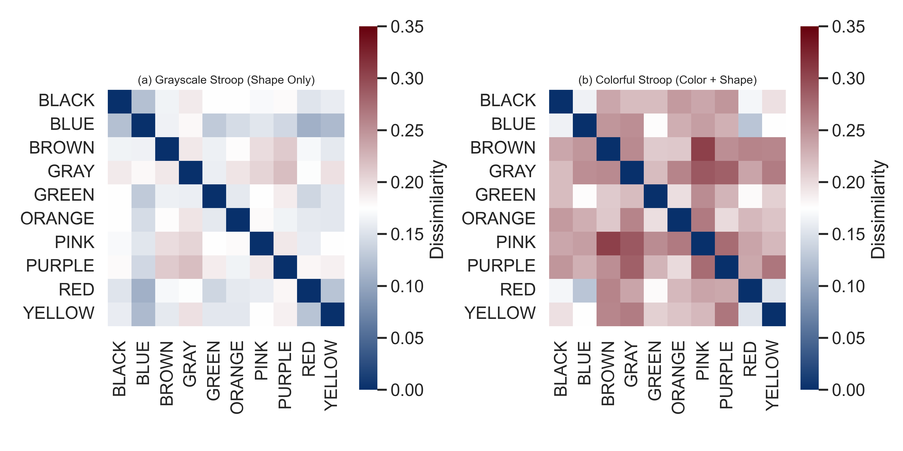
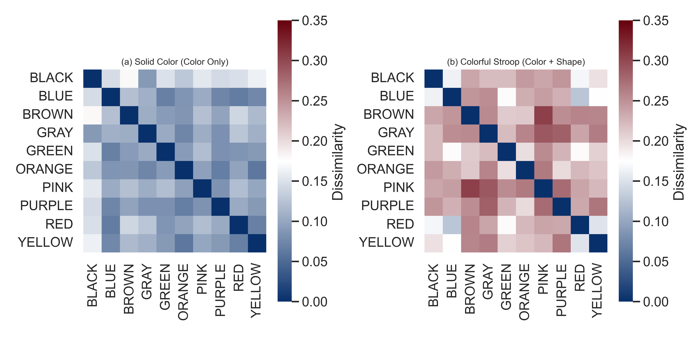
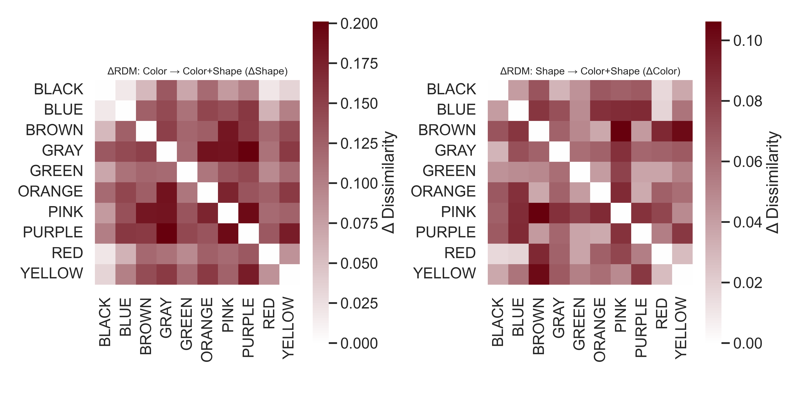

# 🎨 CLIP RDM Analysis — Stroop-Style Visual Conflicts

This directory contains **Representational Dissimilarity Matrix (RDM)** analyses for the Stroop-style experiments performed with **CLIP (ViT-B/32)**.  
The goal is to compare how CLIP’s embedding space represents **color**, **shape (word form)**, and their **combination** when word and ink cues align.

---

## 🧩 Overview

We compute three types of RDMs and two difference (Δ) maps:

| Dataset | Description | Purpose |
|----------|--------------|----------|
| **Grayscale** | Word-only stimuli (no color) | Measures *shape-based* similarity |
| **Color Patches** | Solid color backgrounds (no words) | Measures *color-based* similarity |
| **Stroop (Congruent)** | Words rendered in matching ink colors (e.g., “RED” in red) | Combines color and word cues |
| **ΔShape (ΔWord)** | Stroop − Color | Added dissimilarity due to **word/shape** information |
| **ΔColor (ΔInk)** | Stroop − Grayscale | Added dissimilarity due to **color** information |

---

## ⚙️ How to Reproduce

1. Make sure the following directories exist and contain 10 images each:
stroop_images/
embedding_level_analysis/clip_rdm_analysis/grayscale_images/
embedding_level_analysis/clip_rdm_analysis/color_patches_single/


2. Run the RDM generator:

```bash
python embedding_level_analysis/clip_rdm_analysis/delta_RDM.py

All .npy matrices and figures will be saved under:

embedding_level_analysis/clip_rdm_analysis/rdm_heatmaps/
├── RDM_stroop.npy
├── RDM_grayscale.npy
├── RDM_color.npy
├── ΔWord.npy
├── ΔInk.npy
└── figures/

Color Scheme

All figures use a pure blue–white–red palette:

Color	Meaning
🔵 Blue	Low dissimilarity (high similarity)
⚪ White	Mid-level dissimilarity
🔴 Red	High dissimilarity (low similarity)

This scale visually emphasizes representational distance between color and shape concepts in CLIP’s embedding space.

📊 Results
1️⃣ Grayscale vs. Stroop (Shape vs. Color+Shape)

Shows how adding color information changes representational distances.

<p align="center">  </p>

Observation: The Stroop RDM (right) shows increased dissimilarity between classes that differ by both color and word, indicating that combined visual and textual cues expand representational separation.

2️⃣ Color vs. Stroop (Color vs. Color+Shape)

Shows how adding word form changes representational geometry.

<p align="center">  </p>

Observation: CLIP embeddings encode shape (word form) as a more distinct dimension than pure color. Adding word information (right) increases pairwise dissimilarities, showing that text structure dominates representation.

3️⃣ ΔRDMs (ΔShape and ΔColor)

Difference maps quantifying the added dissimilarity due to shape or color cues.

<p align="center">  </p>

Interpretation:

ΔShape (left): Adding word form contributes stronger dissimilarity shifts (more red), confirming CLIP’s sensitivity to textual shapes.

ΔColor (right): Adding color yields weaker and more diffuse effects, consistent with a weaker color representation in the embedding space.

🧩 Summary
Contrast	Strong Effect	Weak Effect	Interpretation
Stroop − Color	✅ Shape	❌ Color	Word form dominates
Stroop − Grayscale	⚪ Moderate	⚪ Diffuse	Color adds minor separation

Overall, CLIP “reads” more than it “sees” — word/shape cues are represented more saliently than color cues, leading to a Stroop-style bias at the embedding level.